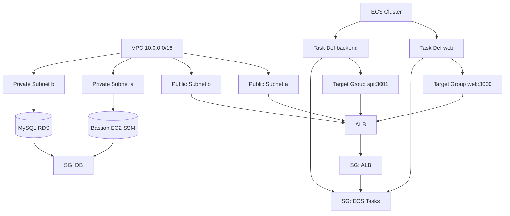
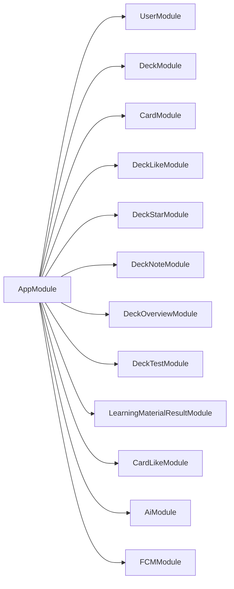

# Breezy Architecture Overview

## 1. Product & Core Value

Breezy is a learning platform for users preparing for exams: users create or upload material (text/files) and Breezy generates structured study assets (flashcards, notes, overviews, quizzes) enhanced with AI. Users then engage through spaced repetition, liking/starring decks & cards, and taking short/long tests, with progress and notifications.

## 2. High-Level System Overview

```mermaid
flowchart LR
  subgraph Client
    W[Web App (Next.js)]
    M[Mobile App (Expo React Native)]
  end

  subgraph Edge
    CDN[(Edge / Browser Cache)]
    ALB[Application Load Balancer]
  end

  subgraph Compute
    ECSW[Web Service (Fargate:3000)]
    ECSB[API Service (NestJS Fargate:3001)]
  end

  subgraph Data
    RDS[(MySQL RDS)]
    S3[(S3 - file uploads)]
    Redis[(Redis - caching / queues)*]
  end

  subgraph AI
    Anthropic[Anthropic API]
  end

  subgraph Support
    SSM[Bastion via SSM]
    CW[CloudWatch Logs]
    SSMParams[SSM Parameter Store]
    Route53[Route53 DNS]
  end

  W -->|HTTPS www| ALB
  M -->|HTTPS api| ALB
  ALB -->|Host=www| ECSW
  ALB -->|Host=api| ECSB
  ECSW -->|SSR/API| ECSB
  ECSB --> RDS
  ECSB --> S3
  ECSB --> Redis
  ECSB --> SSMParams
  ECSB --> Anthropic
  SSM -. secure tunnel .-> RDS
  ECSB --> CW
  ECSW --> CW
  Route53 --> ALB
```

\*Redis is provisioned conceptually (referenced in stack) for future caching / job orchestration.

## 3. Infrastructure (Terraform) Breakdown



### Notable Practices

- Host-based ALB routing
- Fargate tasks pull secrets from SSM Parameter Store (DATABASE_URL, API keys, Firebase creds).
- Private RDS (no public exposure), accessed by ECS tasks + optional SSM bastion via port forwarding.
- Parameter group enables slow query logging for performance tuning.
- CloudWatch log groups per service with 7-day retention.

## 4. Backend Code Architecture (NestJS + Prisma)



### Layering & Patterns

- Feature-First Modules: Each domain (deck, card, test, AI generation, notifications) encapsulates controller (REST endpoints), service (business logic), DTOs (validation/typing), and integration (Prisma client usage).
- DTO Validation & Explicit Contracts: Ensures predictable request/response shapes for API consumers.
- Prisma as ORM/Data Mapper: Clear relational model (User, Deck, Card, Tests, AI Generation Results, Engagement Entities like Like/Star) enabling optimized indexed queries.
- Scheduled / Async Work: `ScheduleModule` included for future cron-driven maintenance (e.g., cleanups, push scheduling).

### Domain Model Highlights

- Content Creation: User -> Deck -> Cards (+ Overview, Notes) with derivations (forking via `originalDeckId`).
- Engagement: Likes, Stars, CardLikes stored as unique composite relations; supports ranking and personalized feeds.
- Assessment: Short tests with ordered questions & scored attempts; indexes favor recent + per-user queries.
- AI Generation: Stores raw input metadata plus generated artifacts (cards, overview, notes) as JSON for replays.
- Notifications: FCM tokens tracked with activation state and metadata.

## 5. Frontend Architecture

### Web App(Next.js)

- Structure: `src/app` (app router & layouts), `features/` (domain-specific UI logic), `features-shared/` (cross-cut helpers), `ui-components/` (presentational primitives), `lib/` (client utilities), `env-var/` (runtime validation), `utils/` (pure helpers).
- State Management: React Query for server state (caching, retries), Jotai for minimal global UI state, local component state for ephemeral interactions.
- Testing: Vitest + Testing Library for unit/integration tests; MSW ready for mocking.
- Performance: Virtualized lists (`react-virtuoso` / `react-window`) for large card sets; drag-and-drop via `@dnd-kit`.
- Resilience: Sentry integration for error monitoring; PWA layer (`features/pwa`).

### Principles

- Feature modularity over type grouping for cohesion.
- No duplication of server state; transformations happen at query select/memo boundaries.
- Explicit form handling and validation (zod or form libs where applicable) for predictable UX.

## 6. Key Features (Business + Technical)

| Category          | Features                                                                                            |
| ----------------- | --------------------------------------------------------------------------------------------------- |
| Content Authoring | Deck creation, derivation (forking), card authoring & ordering, notes & overviews generation        |
| AI Assistance     | Automated card/note/overview generation from text or file input (Anthropic)                         |
| Engagement        | Likes, Stars, Card Likes, public visibility, discovery scaffolding                                  |
| Assessment        | Short & long tests with question ordering, scoring, grading responses                               |
| Personalization   | Memorization flags per card, user-centric indexing for fast queries                                 |
| Notifications     | FCM token management for targeted push (future scheduling)                                          |
| Observability     | Slow query logging, structured logs per service, health endpoint                                    |
| Security & Ops    | Private RDS, least-privilege SSM parameter access, bastion via SSM, TLS via ACM, host-based routing |

## 7. Security & Reliability Considerations

- Defense-in-Depth: Private DB, segregated SGs (ALB -> ECS -> RDS), explicit ingress rules.
- Secrets Hygiene: All sensitive values sourced from SSM Parameter Store, not baked into images.
- Transport Security: HTTPS only (ALB listener 443). Automatic cert validation via Route53 DNS records.
- Performance Profiling: Slow query log enables targeted MySQL optimizations.
- Scalability Path: Independent scaling of web vs backend ECS services; NAT-less design reduces cost (public subnets for tasks) while still protecting DB.

## 8. Future Enhancements

- Horizontal auto-scaling policies based on CPU/memory & custom metrics (queue depth, request latency).
- Read replica / Multi-AZ RDS for HA as user base grows.
