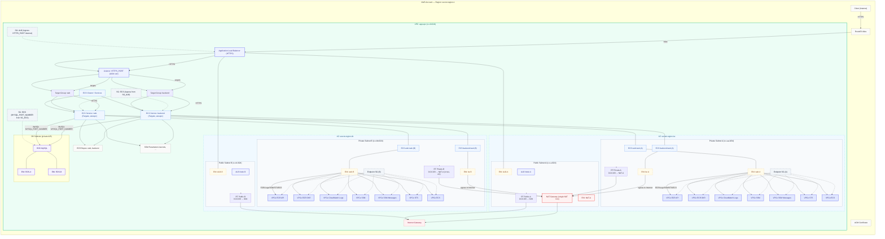

```mermaid
%% Code is written from high level to low level.

flowchart TB
  subgraph AWS["AWS Account — Region: secret-region-1"]
    direction TB

    subgraph VPC["VPC: app-vpc (x.x.0.0/16)"]
      direction LR

      IGW["Internet Gateway"]

      %% ---------------- AZ a ----------------
      subgraph AZA["AZ: secret-region-1a"]
        direction TB

        subgraph PUBA["Public Subnet A (x.x.a.0/24)"]
          ALB_A["ALB Node A"]
          ENI_ALB_A["ENI: ALB-A"]
          NAT_A["NAT Gateway (single NAT in A)"]
          ENI_NAT_A["ENI: NAT-A"]
          RT_PUB_A["RT Public-A\n0.0.0.0/0 → IGW"]
        end

        subgraph PRVA["Private Subnet A (x.x.aa.0/24)"]
          ECS_WEB_A["ECS web task (A)"]
          ECS_BE_A["ECS backend task (A)"]
          ENI_TASK_A1["ENI: web A"]
          ENI_TASK_A2["ENI: be A"]
          RT_PRV_A["RT Private-A\n0.0.0.0/0 → NAT-A"]

          %% Interface Endpoints (A) Some endpoints are not used, and should be removed soon.
          EP_ECRAPI_A["VPCe ECR API"]
          EP_ECRDKR_A["VPCe ECR DKR"]
          EP_LOGS_A["VPCe CloudWatch Logs"]
          EP_SSM_A["VPCe SSM"]
          EP_SSMMSG_A["VPCe SSM Messages"]
          EP_STS_A["VPCe STS"]
          EP_ECS_A["VPCe ECS"]
          EP_SG_A["Endpoint SG (A)"]
        end
      end

      %% ---------------- AZ b ----------------
      subgraph AZB["AZ: secret-region-1b"]
        direction TB

        subgraph PUBB["Public Subnet B (x.x.b.0/24)"]
          ALB_B["ALB Node B"]
          ENI_ALB_B["ENI: ALB-B"]
          RT_PUB_B["RT Public-B\n0.0.0.0/0 → IGW"]
        end

        subgraph PRVB["Private Subnet B (x.x.bb.0/24)"]
          ECS_WEB_B["ECS web task (B)"]
          ECS_BE_B["ECS backend task (B)"]
          ENI_TASK_B1["ENI: web B"]
          ENI_TASK_B2["ENI: be B"]
          RT_PRV_B["RT Private-B\n0.0.0.0/0 → NAT-A (cross-AZ)"]

          %% Interface Endpoints (B)
          EP_ECRAPI_B["VPCe ECR API"]
          EP_ECRDKR_B["VPCe ECR DKR"]
          EP_LOGS_B["VPCe CloudWatch Logs"]
          EP_SSM_B["VPCe SSM"]
          EP_SSMMSG_B["VPCe SSM Messages"]
          EP_STS_B["VPCe STS"]
          EP_ECS_B["VPCe ECS"]
          EP_SG_B["Endpoint SG (B)"]
        end
      end

      %% ---------- Public subnet routing ----------
      PUBA --> RT_PUB_A --> IGW
      PUBB --> RT_PUB_B --> IGW

      %% ---------- Private subnet routing ----------
      PRVA --> RT_PRV_A --> NAT_A
      PRVB --> RT_PRV_B --> NAT_A
      NAT_A --> IGW

      %% ---------- ALB + Listener + Target Groups ----------
      ALB["Application Load Balancer (HTTPS)"]
      LHTTPS_PORT["Listener :HTTPS_PORT (ACM cert)"]
      TG_WEB["Target Group: web"]
      TG_BE["Target Group: backend"]

      ALB --- ENI_ALB_A
      ALB --- ENI_ALB_B
      ALB --> LHTTPS_PORT
      LHTTPS_PORT --> TG_WEB
      LHTTPS_PORT --> TG_BE

      %% ---------- ECS Services / Cluster ----------
      ECSCL["ECS Cluster / Services"]
      SVC_WEB["ECS Service: web (Fargate, awsvpc)"]
      SVC_BE["ECS Service: backend (Fargate, awsvpc)"]

      ECSCL --> SVC_WEB
      ECSCL --> SVC_BE
      TG_WEB --> SVC_WEB
      TG_BE  --> SVC_BE

      %% Tasks bound to ENIs (one per task)
      SVC_WEB --- ECS_WEB_A
      SVC_WEB --- ECS_WEB_B
      SVC_BE  --- ECS_BE_A
      SVC_BE  --- ECS_BE_B

      ECS_WEB_A --- ENI_TASK_A1
      ECS_WEB_B --- ENI_TASK_B1
      ECS_BE_A  --- ENI_TASK_A2
      ECS_BE_B  --- ENI_TASK_B2

      %% ---------- RDS ----------
      subgraph DBZ["DB Subnets (private A/B)"]
        direction TB
        RDS["RDS MySQL"]
        ENI_RDS_A["ENI: RDS-A"]
        ENI_RDS_B["ENI: RDS-B"]
      end
      RDS --- ENI_RDS_A
      RDS --- ENI_RDS_B

      %% ---------- Control-plane references ----------
      ECR["ECR Repos: web, backend"]
      SSM["SSM Parameters:\secrets, ..."]
      SVC_WEB --> ECR
      SVC_BE  --> ECR
      SVC_WEB --> SSM
      SVC_BE  --> SSM

      %% ---------- Interface Endpoint flows ----------
      ENI_TASK_A1 -->|ECR/Logs/SSM/STS/ECS| EP_ECRAPI_A
      ENI_TASK_A1 --> EP_ECRDKR_A
      ENI_TASK_A1 --> EP_LOGS_A
      ENI_TASK_A1 --> EP_SSM_A
      ENI_TASK_A1 --> EP_SSMMSG_A
      ENI_TASK_A1 --> EP_STS_A
      ENI_TASK_A1 --> EP_ECS_A

      ENI_TASK_B1 -->|ECR/Logs/SSM/STS/ECS| EP_ECRAPI_B
      ENI_TASK_B1 --> EP_ECRDKR_B
      ENI_TASK_B1 --> EP_LOGS_B
      ENI_TASK_B1 --> EP_SSM_B
      ENI_TASK_B1 --> EP_SSMMSG_B
      ENI_TASK_B1 --> EP_STS_B
      ENI_TASK_B1 --> EP_ECS_B

      %% ---------- SGs (dotted to distinguish them from the traffic) ----------
      SG_ALB["SG: ALB (ingress HTTPS_PORT Internet)"]
      SG_ECS["SG: ECS (ingress from SG_ALB)"]
      SG_RDS["SG: RDS (MYSQL_PORT_NUMBER from SG_ECS)"]

      SG_ALB -.-> ALB
      SG_ECS -.-> SVC_WEB
      SG_ECS -.-> SVC_BE
      SG_RDS -.-> RDS

      EP_SG_A -.-> EP_ECRAPI_A
      EP_SG_A -.-> EP_ECRDKR_A
      EP_SG_A -.-> EP_LOGS_A
      EP_SG_A -.-> EP_SSM_A
      EP_SG_A -.-> EP_SSMMSG_A
      EP_SG_A -.-> EP_STS_A
      EP_SG_A -.-> EP_ECS_A

      EP_SG_B -.-> EP_ECRAPI_B
      EP_SG_B -.-> EP_ECRDKR_B
      EP_SG_B -.-> EP_LOGS_B
      EP_SG_B -.-> EP_SSM_B
      EP_SG_B -.-> EP_SSMMSG_B
      EP_SG_B -.-> EP_STS_B
      EP_SG_B -.-> EP_ECS_B
    end

    %% ---------- Ingress (Internet → Tasks) ----------
    CLIENT["Client (Internet)"]
    R53["Route53 Alias"]
    ACM["ACM Certificate"]

    CLIENT -->|HTTPS| R53
    R53 -->|Alias| ALB
    ALB -->|HTTPS| LHTTPS_PORT
    LHTTPS_PORT -->|targets| TG_WEB
    LHTTPS_PORT -->|targets| TG_BE
    TG_WEB -->|HTTPS| SVC_WEB
    TG_BE  -->|HTTPS| SVC_BE

    %% ---------- DB traffic (Tasks → RDS) ----------
    SVC_WEB -->|MySQL MYSQL_PORT_NUMBER| RDS
    SVC_BE  -->|MySQL MYSQL_PORT_NUMBER| RDS

    %% ---------- NAT egress (public Internet) ----------
    ENI_TASK_A2 -->|egress to Internet| NAT_A
    ENI_TASK_B2 -->|egress to Internet| NAT_A
  end

  %% =============== Styling (nodes only) ===============
  classDef vpc      fill:#ECFDF5,stroke:#10B981,color:#065F46,stroke-width:2px
  classDef az       fill:#F0F9FF,stroke:#38BDF8,color:#0C4A6E,stroke-dasharray:3 3
  classDef subnet   fill:#F8FAFC,stroke:#94A3B8,color:#0F172A
  classDef nat      fill:#FEF2F2,stroke:#EF4444,color:#7F1D1D,stroke-width:2px
  classDef igw      fill:#FFF1F2,stroke:#FB7185,color:#881337
  classDef alb      fill:#EEF2FF,stroke:#6366F1,color:#312E81,stroke-width:2px
  classDef ecs      fill:#EFF6FF,stroke:#3B82F6,color:#1E3A8A
  classDef eni      fill:#FFFBEB,stroke:#F59E0B,color:#78350F,stroke-dasharray:2 2
  classDef ep       fill:#E0E7FF,stroke:#6366F1,color:#312E81,stroke-width:2px
  classDef rds      fill:#F5F3FF,stroke:#8B5CF6,color:#2E1065,stroke-width:2px
  classDef sg       fill:#F1F5F9,stroke:#64748B,color:#0F172A,stroke-dasharray:4 2
  classDef misc     fill:#FAFAF9,stroke:#A8A29E,color:#292524

  class VPC vpc
  class AZA,AZB az
  class PUBA,PUBB,PRVA,PRVB subnet
  class NAT_A,ENI_NAT_A nat
  class IGW igw
  class ALB,ALB_A,ALB_B,LHTTPS_PORT alb
  class ENI_ALB_A,ENI_ALB_B,ENI_TASK_A1,ENI_TASK_A2,ENI_TASK_B1,ENI_TASK_B2 eni
  class ECSCL,SVC_WEB,SVC_BE,ECS_WEB_A,ECS_WEB_B,ECS_BE_A,ECS_BE_B ecs
  class EP_ECRAPI_A,EP_ECRDKR_A,EP_LOGS_A,EP_SSM_A,EP_SSMMSG_A,EP_STS_A,EP_ECS_A ep
  class EP_ECRAPI_B,EP_ECRDKR_B,EP_LOGS_B,EP_SSM_B,EP_SSMMSG_B,EP_STS_B,EP_ECS_B ep
  class RDS,ENI_RDS_A,ENI_RDS_B rds
  class SG_ALB,SG_ECS,SG_RDS,EP_SG_A,EP_SG_B sg
  class ECR,SSM,R53,ACM,CLIENT misc


```
